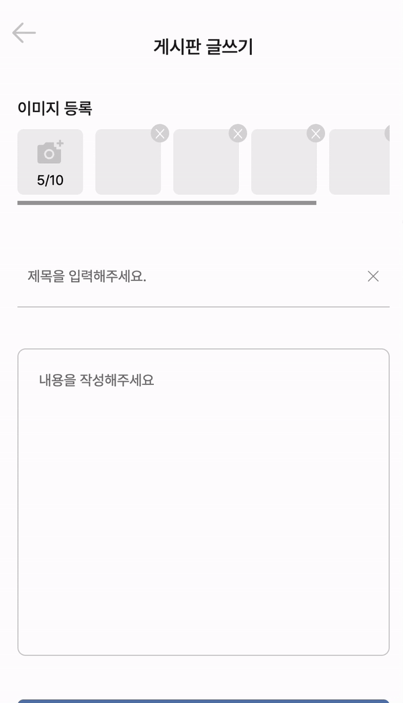
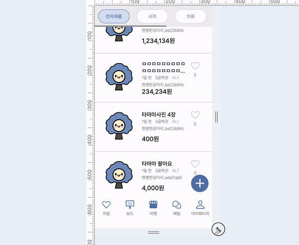
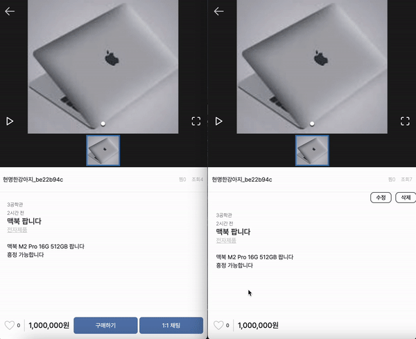
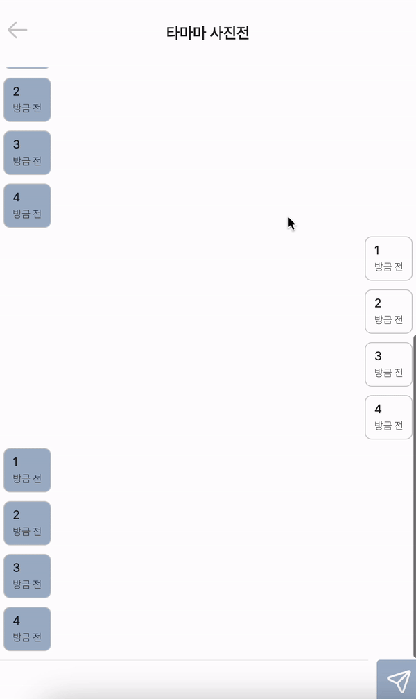

# 서비스

<a href="https://mju-market.vercel.app">MJU-market 서비스 바로가기</a>

# 기능 소개

<table>
  <caption>로그인 유효성 검사</caption>
    <td></td>
</table>
<table>
  <caption>마켓 기능</caption>
  <tr>
    <td>
무한스크롤
</td>
    <td>
카테고리 선택 및 이미지 슬라이드
</td>
  </tr>
  <tr>
    <td>
좋아요 기능
</td>
    <td>
상품 게시글 작성 기능
</td>
    <td>
댓글 작성 기능
</td>
  </tr>
</table>
<table>
  <td>
상품 구매 기능
</td>
  <td>
반응형 디자인 말줄임표
</td>
</table>
<table>
  <caption>채팅 기능</caption>
  <td>
Socket 실시간 채팅 기능
</td>
  <td>
채팅 무한스크롤
</td>
</table>

## Convention ✅

### Branch Naming Convention 🪵

| 머릿말     | 설명                   |
|---------|----------------------|
| main    | 서비스 브랜치              |
| develop | 배포 전 작업 기준           |
| feature | 기능 단위 구현             |
| hotfix  | 서비스 중 긴급 수정 건에 대한 처리 |

### Commit Convention 🚥

| 머릿말      | 설명                                     |
|----------|----------------------------------------|
| feat     | 기능 구현, 추가                              |
| fix      | 버그 수정, 예외 케이스 대응, 기능 개선                |
| design   | UI 디자인                                 |
| setting  | 패키지 설치, 개발 설정                          |
| refactor | 코드 리팩터링                                |
| style    | 코드 스타일 수정 (code formatting, 세미콜론 추가 등) |
| rename   | 파일명(or 폴더명)을 수정한 경우                    |
| test     | 테스트 코드 추가                              |
| docs     | README.md 작성 및 변경                      |
| hotfix   | 치명적인 버그를 급하게 수정하는 경우                   |
